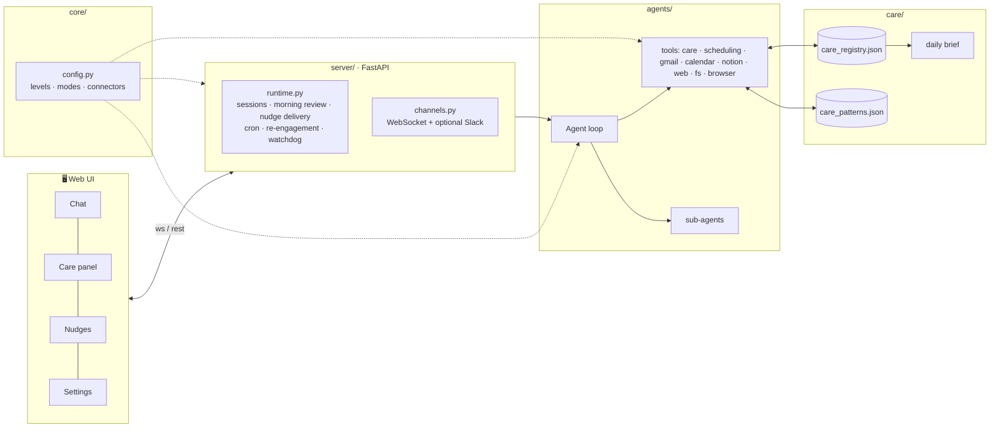
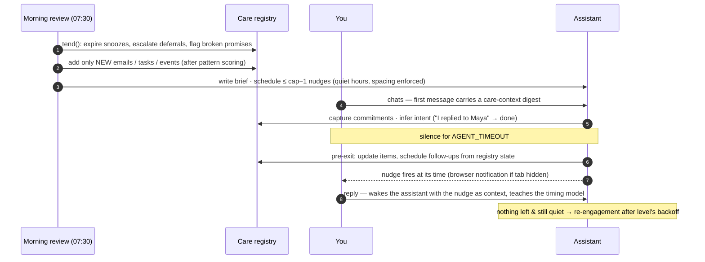

<div align="center">

# 🦞 ProactiveClaw

**The assistant that comes to you.**

A local, open-source personal assistant that keeps track of what matters, reviews it every morning, nudges you at the right moment, and learns what you actually care about. You decide how proactive it is, with one dial.

[](https://www.python.org/)
[](LICENSE)
[](src/tests)
[](#privacy)
[](#quick-start)

[Quick start](#quick-start) · [What it does](#what-it-does) · [Proactiveness dial](#the-proactiveness-dial) · [Connectors](#connectors-all-optional) · [How it works](#how-it-works) · [Configuration](docs/CONFIGURATION.md)


</div>

---

## Why

Every assistant waits to be asked. Meanwhile the things that actually matter slip: the email you meant to answer tonight, the "I'll call her before Thursday" you said out loud, the task that's been quietly deferred three mornings in a row.

ProactiveClaw keeps a **care registry** of those things, tends it every morning, and reaches out with something specific and actionable, never more often than you've allowed. Say *"I just replied to Maya"* and the item closes itself. Say *"be less pushy"* and it is.

## Quick start

```bash
git clone https://github.com/Harpreet221295/ProactiveClaw.git
cd ProactiveClaw
./setup.sh      # creates .venv, installs deps, runs a short wizard
./run.sh        # → http://127.0.0.1:8000
```

You need **one LLM key** (OpenAI *or* Anthropic). Everything else is optional and can be added later from ⚙️ Settings. Python 3.11+, macOS/Linux (Windows via WSL).

<details>
<summary><b>Manual setup</b> (no wizard)</summary>

```bash
python3 -m venv .venv && source .venv/bin/activate
pip install -r requirements.txt
cp .env.example .env                        # add OPENAI_API_KEY or ANTHROPIC_API_KEY
cp config/config.example.json config/config.json
python src/serve.py
```
</details>

<details>
<summary><b>Try it in 60 seconds</b></summary>

Open the UI and type:

> I have to call Simran tonight about the visa paperwork, and I promised Maya I'd review her proposal before Thursday.

Both land in the **Care** panel with deadlines. Then:

> Just called Simran. And be a bit less pushy going forward.

The first item closes, the level pill drops to `minimal`. Click **☀️ Review now** to see a morning review run, or **💤 Sleep** to watch it plan follow-ups.
</details>

## What it does

| Feature | What it does |
|:--|:--|
| 🗂️ **Care registry** | One place for everything worth tracking: emails needing action, tasks with deadlines, promises made in chat, follow-ups it owes you. Real lifecycle: `new → acknowledged → in progress / deferred / snoozed → done / dismissed`. |
| 🗣️ **Commitment capture** | *"I need to send the deck by Friday"* becomes a tracked item with a deadline and a nudge. Sensitivity follows your level. |
| ☀️ **Morning review** | Deterministic housekeeping first (expire snoozes, escalate repeated deferrals, flag broken "tonight" promises, archive stale items), then pull only what's **new** from your sources, write a brief, schedule a few well-timed nudges. |
| 📣 **Nudges that respect you** | Capped per day, never in quiet hours, spaced 30 min apart, tied to a specific item. Enforced in code, not just prompts. |
| 🧠 **Pattern learning** | Dismiss a sender three times and they stop surfacing. Always act on a topic and it gets boosted. *"Ignore newsletters"* becomes a rule. |
| 🌙 **Re-engagement** | Gone quiet after the nudges ran out? It waits (3 days, a week, …) and comes back with one concrete thing, timed by a bandit that learns when you actually reply. |
| 💬 **A proper assistant** | Web search, files, charts, calendar, email, Notion, browser, whichever you enable. Long-term memory (vector + knowledge graph) with passive recall. Background sub-agents for big jobs. |
| 🔌 **Optional everything** | Gmail, Calendar, Notion, web search, browser and Slack are connectors you switch on. Off means invisible to the model. |

## The proactiveness dial

Set it in Settings, in the wizard, or just say it: *"stop reaching out"*, *"nudge me more"*.

| Level | What you get |
|:--|:--|
| **off** | Reactive only. Never reaches out. Explicit reminders and cron jobs still fire. |
| **minimal** | Deadline-driven only. ≤ 1 nudge/day, silent morning review, no re-engagement. |
| **balanced** ← default | Daily review, ≤ 3 nudges/day, asks before tracking borderline commitments, re-engages after a week. |
| **active** | ≤ 6 nudges/day, aggressive commitment capture, follows up on research, re-engages after 3 days. |
| **max** | ≤ 10 nudges/day, short quiet hours, tracks anything commitment-shaped, re-engages daily. |

**Care modes** layer your current situation on top. *"I'm heads down this week"*, *"we're fundraising"*, *"travelling till Friday"*:

| Mode | Effect |
|:--|:--|
| `focus` | High-urgency only, ≤ 2 nudges/day, conservative capture |
| `fundraising` | Investor / term sheet / board / legal boosted and escalated faster, cap raised |
| `travel` | Long quiet hours, only truly urgent items |
| `heads_down` | Near silent: hard deadlines only, no capture |

Resolution order: `defaults ← level ← mode ← your overrides`. Every knob (cap, quiet hours, urgency threshold, boosted/muted topics …) is in Settings → Fine-tuning. Full reference in [docs/CONFIGURATION.md](docs/CONFIGURATION.md).

## Connectors (all optional)

| Connector | Needs | Lets it |
|:--|:--|:--|
| 🔍 **Web search** | `TAVILY_API_KEY` ([free tier](https://tavily.com)) | look things up |
| ✉️ **Gmail** | `credentials.json` + one-time sign-in | read your inbox, track emails needing action. **Never sends unless you ask.** |
| 📅 **Google Calendar** | same as Gmail | see events, avoid nudging during meetings, create events on request |
| 📝 **Notion** | `NOTION_API_KEY` ([integration](https://www.notion.so/my-integrations)) | search pages, query your tasks database |
| 🌐 **Browser** | `BROWSER_TOKEN` + [extension](src/browser_extension) | drive Chrome when you explicitly ask |
| 💬 **Slack** | bot token, signing secret, member id | also deliver to a Slack DM (web UI stays primary) |

A connector is active only when it's **enabled in config *and* its credentials exist**.

<details>
<summary><b>Google setup (Gmail + Calendar)</b></summary>

1. [Google Cloud Console](https://console.cloud.google.com/) → new project → enable **Gmail API** and **Google Calendar API**.
2. Credentials → *Create credentials* → **OAuth client ID** → *Desktop app* → download → save as `credentials.json` in the project root.
3. OAuth consent screen → add yourself as a test user.
4. Settings → enable Gmail/Calendar → **Connect Google**. A browser window signs you in once; `token.json` is stored locally and refreshed automatically. (CLI: `python src/setup_wizard.py --google`.)
</details>

<details>
<summary><b>Slack setup</b></summary>

1. [api.slack.com/apps](https://api.slack.com/apps) → new app → **OAuth & Permissions** → scopes `chat:write`, `im:history`, `im:read`, `im:write`, `files:read` → install.
2. Put `SLACK_BOT_TOKEN`, `SLACK_SIGNING_SECRET`, `SLACK_USER_ID` in `.env`. Outbound delivery now works.
3. To *send* from Slack too: `ngrok http 8000`, then Event Subscriptions → Request URL `https://<ngrok>/slack/events`, event `message.im`.
</details>

## How it works



**A day in the life**



<details>
<summary><b>State on disk</b> (all gitignored)</summary>

| Path | Contents |
|:--|:--|
| `engagement_data/care_registry.json` | items, lifecycle, intents, nudge counts, last-check timestamps |
| `engagement_data/care_patterns.json` | learned sender/topic tendencies + explicit mute/boost rules |
| `engagement_data/queue.json`, `reminders.json`, `cron_jobs.json`, `nudge_log.json` | scheduling state |
| `agent_file_system/` | the assistant's workspace: brief, notes, files it makes for you |
| `sessions/`, `data/transcript.jsonl` | conversation history |
| `data/mem0/`, `data/kuzu_graph/`, `data/bandit_state.json` | long-term memory and timing model |
</details>

## Commands

| Command | Does |
|:--|:--|
| `./run.sh` | start the server + UI |
| `./run.sh --cli` | terminal chat (nudges aren't delivered in this mode) |
| `./health_check.sh --fast` | verify keys, connectors, storage |
| `python src/setup_wizard.py` | re-run setup, existing values kept as defaults |
| `pytest` | run the test suite (no API calls) |
| `./bash_scripts/reset/full_reset.sh --dry-run` | see what a full reset would wipe |

Environment variables: [`.env.example`](.env.example). Server address: `HOST`, `PORT`.

<details>
<summary><b>Project layout</b></summary>

```
src/
├── serve.py               entry point (web server)
├── main.py                CLI chat
├── setup_wizard.py        first-run setup
├── server/                app.py (routes) · runtime.py (proactive loops) · channels.py · browser_bridge.py
├── web/                   index.html · app.js · style.css   (no build step)
├── core/                  config.py (levels, modes, connectors) · paths.py
├── care/                  registry.py · patterns.py · brief.py · nudges.py
├── agents/                agent.py · prompts/ · tools/ · sub-agent runner
├── llms/                  OpenAI + Anthropic behind one interface
├── memory.py, memory_tier1/   mem0 + graph memory, passive recall
├── personalized_bandits/  response-time bandit
├── health_check/ · reset/ · memory_monitor/
└── tests/                 pytest suite
```
</details>

## Privacy

- Runs entirely on your machine. The only outbound calls are to your LLM provider and the connectors you enable.
- It **never sends email or messages on your behalf unless you explicitly ask** in that conversation.
- Secrets (`.env`, `credentials.json`, `token.json`) and all runtime data are gitignored. Don't commit `config/config.json` either.

## Roadmap

- [ ] First-run setup inside the UI (paste a key, done)
- [ ] Docker image / `pipx install`
- [ ] Action buttons on nudges (Done · Snooze · Draft reply)
- [ ] Visible review status and error log in the UI
- [ ] Daily token / cost counter
- [ ] Hosted Google OAuth client so "Connect Google" is one click

Ideas and PRs welcome. Start with [docs/CONFIGURATION.md](docs/CONFIGURATION.md) and the manual [test plan](src/tests/test_plan.txt).

## Relationship to OpenClaw

ProactiveClaw takes its name (and the lobster) from [OpenClaw](https://github.com/openclaw/openclaw), but it is an independent project, not a fork, and it is not affiliated with the OpenClaw Foundation. OpenClaw is a general "does things when you ask" agent; ProactiveClaw's whole point is the other half of the loop: a care registry, a morning review, a proactiveness dial, commitment capture and pattern learning, so the assistant comes to *you* with the right thing at the right time. Both are MIT licensed.

## License

[MIT](LICENSE) © Harpreet Singh
