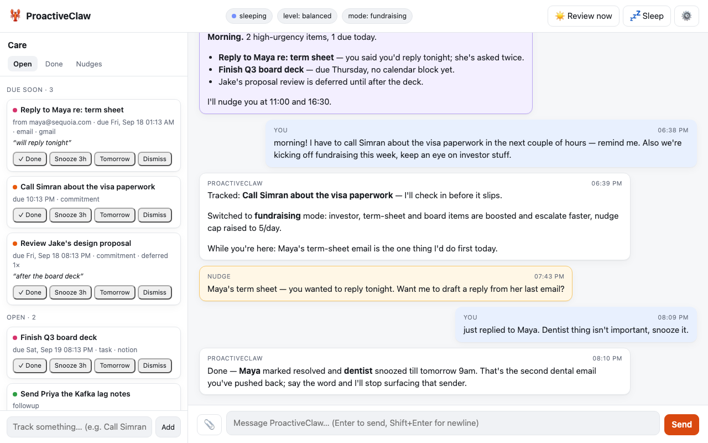

# 🦞 ProactiveClaw

**A personal assistant that reaches out to you — as much or as little as you want.**

Most assistants wait to be asked. ProactiveClaw keeps a running *care registry* of the things that matter to you (emails that need a reply, tasks with deadlines, promises you made in conversation), reviews it every morning, nudges you at sensible times, learns what you actually care about, and gently checks in when you've gone quiet. You choose how proactive it is with a single dial.

It runs locally, in your browser, with your own API key. Gmail, Google Calendar, Notion, web search and Slack are **optional connectors** — turn on only what you're comfortable with.

<p align="center"></p>

---

## Quick start (5 minutes)

```bash
git clone https://github.com/Harpreet221295/ProactiveClaw.git
cd ProactiveClaw
./setup.sh        # creates .venv, installs deps, runs the setup wizard
./run.sh          # → open http://127.0.0.1:8000
```

The wizard asks for **one LLM key** (OpenAI *or* Anthropic) and lets you skip everything else. You can add connectors later from the ⚙️ Settings panel or by editing `.env` and `config/config.json`.

Requirements: Python 3.11+, macOS or Linux (Windows works via WSL).

<details>
<summary>Manual setup instead of the wizard</summary>

```bash
python3 -m venv .venv && source .venv/bin/activate
pip install -r requirements.txt
cp .env.example .env                       # add OPENAI_API_KEY or ANTHROPIC_API_KEY
cp config/config.example.json config/config.json
python src/serve.py
```
</details>

---

## What it does

| | |
|---|---|
| **Chat** | A normal assistant with tools: web search, files, charts, calendar, email, Notion, browser — whichever you enable. |
| **Care registry** | Everything worth tracking lives in one place with a lifecycle (`new → acknowledged → in_progress / deferred / snoozed → done / dismissed`). Say *"I just replied to Maya"* and the matching item is resolved — no commands needed. |
| **Commitment capture** | *"I have to call Simran tonight"* becomes a tracked item with a deadline and a nudge. Sensitivity depends on your level. |
| **Morning review** | Every day at your chosen time: tend existing items (expire snoozes, escalate repeated deferrals, flag broken "I'll do it tonight" promises), pull only *new* emails/tasks/events, write a brief, schedule a few well-timed nudges. |
| **Nudges** | Short, specific check-ins ("Meeting with Sarah in 1h — you wanted to raise the Q2 budget"). Capped per day, never during quiet hours, spaced apart, linked to registry items. |
| **Pattern learning** | Dismiss emails from a sender three times and they stop surfacing. Always act on a topic and it gets boosted. Tell it *"ignore newsletters"* and that becomes a rule. |
| **Re-engagement** | If you go silent after the nudges run out, it waits (3 days / a week / …) and reaches out with something concrete from your history — timed using a bandit model of when you usually respond. |
| **Memory** | Long-term memory (vector + knowledge graph via mem0) plus passive "tier-1" recall that injects related facts when you mention a person or project. |
| **Sub-agents** | Long jobs ("triage all my unread email") run as background processes and report back. |

---

## How proactive should it be?

Pick a level in Settings, in the wizard, or just tell it: *"be less pushy"*, *"nudge me more"*, *"stop reaching out"*.

| Level | What you get |
|---|---|
| **off** | Reactive only. Never reaches out. Reminders and cron jobs you set explicitly still fire. |
| **minimal** | Deadline-driven only. ≤1 nudge/day, morning review runs silently, no re-engagement. |
| **balanced** *(default)* | Daily morning review, ≤3 nudges/day, asks before tracking borderline commitments, re-engages after a week. |
| **active** | ≤6 nudges/day, captures commitments aggressively, follows up on research, re-engages after 3 days. |
| **max** | ≤10 nudges/day, short quiet hours, tracks anything that sounds like a commitment, re-engages daily. |

**Care modes** layer a situation on top of the level — *"I'm heads down this week"*, *"we're fundraising"*, *"I'm travelling till Friday"*:

| Mode | Effect |
|---|---|
| `normal` | No extra filtering. |
| `focus` | Only high-urgency items, ≤2 nudges/day, conservative capture. |
| `fundraising` | Investor / term sheet / board / legal topics boosted and escalated faster; nudge cap raised. |
| `travel` | Long quiet hours, only truly urgent items. |
| `heads_down` | Near-silent: hard deadlines only, no commitment capture. |

Fine-tune anything (nudge cap, quiet hours, urgency threshold, boosted/muted topics …) in Settings → *Fine-tuning*. Resolution order: defaults ← level ← mode ← your overrides. See [docs/CONFIGURATION.md](docs/CONFIGURATION.md).

---

## Connectors (all optional)

| Connector | Needs | What the assistant can do |
|---|---|---|
| **Web search** | `TAVILY_API_KEY` ([free tier](https://tavily.com)) | Look things up. |
| **Gmail** | `credentials.json` from Google Cloud + one-time sign-in | Read your inbox, track emails needing action. **Never sends unless you ask.** |
| **Google Calendar** | same as Gmail | See events, avoid nudging during meetings, create events on request. |
| **Notion** | `NOTION_API_KEY` ([integration](https://www.notion.so/my-integrations)) + share pages with it | Search/read pages, query your tasks database. |
| **Browser** | `BROWSER_TOKEN` + the Chrome extension in `src/browser_extension/` | Drive your browser when you explicitly ask. |
| **Slack** | `SLACK_BOT_TOKEN`, `SLACK_SIGNING_SECRET`, `SLACK_USER_ID` | Also deliver messages to a Slack DM (the web UI stays primary). |

A connector is active only when it's **enabled in config *and* its credentials exist**. Disabled connectors are invisible to the model — it won't pretend to have them.

<details>
<summary>Google (Gmail + Calendar) setup</summary>

1. [Google Cloud Console](https://console.cloud.google.com/) → create a project → enable **Gmail API** and **Google Calendar API**.
2. APIs & Services → Credentials → *Create credentials* → **OAuth client ID** → *Desktop app*. Download the JSON and save it as `credentials.json` in the project root.
3. OAuth consent screen → add yourself as a test user.
4. Enable Gmail/Calendar in Settings and click **Connect Google** (or run `python src/setup_wizard.py --google`). A browser window signs you in once; `token.json` is stored locally and refreshed automatically.
</details>

<details>
<summary>Slack setup (optional)</summary>

1. [api.slack.com/apps](https://api.slack.com/apps) → create app → **OAuth & Permissions** → scopes `chat:write`, `im:history`, `im:read`, `im:write`, `files:read` → install.
2. Put the bot token, signing secret and your member id in `.env`.
3. To *send* messages from Slack too, expose the server (`ngrok http 8000`) and set Event Subscriptions → Request URL to `https://<ngrok>/slack/events`, event `message.im`.
</details>

---

## Using it

- **Chat** as you would with any assistant. Mention commitments naturally; they show up in the **Care** panel.
- **Care panel** (left): open items grouped by *overdue / due soon / open / snoozed*, with one-click *Done / Snooze / Dismiss*. Dismissals teach the pattern learner.
- **Nudges tab**: what's queued, today's budget, morning-review status. Cancel anything you don't want.
- **☀️ Review now** runs the morning review on demand. **💤 Sleep** ends the session immediately (runs the pre-exit flow that plans follow-ups).
- **Browser notifications** fire for nudges when the tab is in the background (allow them when prompted).
- Ask *"how proactive are you?"*, *"what are you tracking?"*, *"ignore anything from that sender"* — the assistant has tools for all of it.

Terminal-only mode (no UI, nudges aren't delivered): `./run.sh --cli`.

---

## How it works

```
                 ┌────────────────────────── web UI (browser) ──────────────────────────┐
                 │  chat  ·  care panel  ·  nudges  ·  settings                          │
                 └───────────────▲──────────────────────────────┬───────────────────────┘
                                 │ WebSocket / REST             │
┌────────────────────────────────┴──────────────────────────────▼─────────────────────────┐
│  server/  (FastAPI)                                                                     │
│   runtime.py   handle_message · idle→pre-exit→sleep · morning review · nudge delivery   │
│                cron jobs · re-engagement · sub-agent watchdog                            │
│   channels.py  broadcast to UI (+ optional Slack) · transcript                          │
└──────┬──────────────────────┬───────────────────────────┬───────────────────────────────┘
       │                      │                           │
┌──────▼───────┐   ┌──────────▼──────────┐   ┌────────────▼──────────────┐
│ agents/      │   │ care/               │   │ core/                     │
│ Agent loop   │   │ registry.py  items  │   │ config.py  levels · modes │
│ prompts      │   │ patterns.py  learn  │   │            connectors     │
│ tools/*      │   │ brief.py     views  │   │ paths.py                  │
│ sub-agents   │   │ nudges.py    budget │   └───────────────────────────┘
└──────────────┘   └─────────────────────┘
```

**A day in the life**

1. **07:30 – morning review** (a protected cron job): `registry.tend()` runs deterministically — snoozes expire, items deferred 3× escalate, overdue promises get flagged, stale low-value items archive. Then the agent pulls *only new* emails/tasks/events since the last check, adds what clears the urgency threshold (after pattern scoring), writes `daily_brief.json` as a view of the registry, and schedules nudges — the code enforces the daily cap, quiet hours, 30-min spacing and leaves headroom for later.
2. **You chat.** The first message of a session gets a `<care_context>` digest so the assistant can weave in what's relevant. Anything you say about tracked items updates them; new commitments are captured per your level.
3. **You go quiet** (`AGENT_TIMEOUT`, default 5 min): the **pre-exit flow** updates the registry from the conversation, schedules follow-ups *from registry state* (linked to item ids, never duplicating queued nudges or reminders), summarises the session into memory, and sleeps.
4. **Nudges fire** at their times. Replying wakes the assistant with the nudge as context. Response timing feeds a 168-arm bandit (day × hour) that learns when you're reachable.
5. **Nothing left and still silent?** Re-engagement waits per your level's backoff, then sends one specific, useful message.

**State on disk** (all gitignored)

| Path | Contents |
|---|---|
| `engagement_data/care_registry.json` | The registry: items, lifecycle, intents, nudge counts, last-check timestamps |
| `engagement_data/care_patterns.json` | Learned sender/topic tendencies + explicit mute/boost rules |
| `engagement_data/queue.json`, `reminders.json`, `cron_jobs.json`, `nudge_log.json` | Scheduling state |
| `agent_file_system/` | The assistant's own workspace (brief, notes, files it makes for you) |
| `sessions/`, `data/transcript.jsonl` | Conversation history |
| `data/mem0/`, `data/kuzu_graph/`, `data/bandit_state.json` | Long-term memory and timing model |

---

## Commands

| | |
|---|---|
| `./run.sh` | Start the server + UI |
| `./run.sh --cli` | Terminal chat |
| `./health_check.sh [--fast]` | Verify keys, connectors, storage |
| `python src/setup_wizard.py` | Re-run setup (keeps existing values as defaults) |
| `pytest` | Run the test suite (no API calls) |
| `./bash_scripts/reset/full_reset.sh [--dry-run]` | Wipe runtime state (memory, registry, queues, sessions) |
| `./memory_monitor.sh` | Watch the knowledge graph fill up |

Environment variables: see [`.env.example`](.env.example). Server host/port: `HOST`, `PORT`.

---

## Project layout

```
src/
├── serve.py            entry point (web server)
├── main.py             CLI chat
├── setup_wizard.py     first-run setup
├── server/             app.py (routes) · runtime.py (proactive loops) · channels.py · browser_bridge.py
├── web/                index.html · app.js · style.css  (no build step)
├── core/               config.py (levels, modes, connectors) · paths.py
├── care/               registry.py · patterns.py · brief.py · nudges.py
├── agents/             agent.py · prompts/ · tools/ (care, scheduling, gmail, calendar, notion, …) · sub-agents
├── llms/               OpenAI + Anthropic clients behind one interface
├── memory.py, memory_tier1/   mem0 + graph memory, passive recall
├── personalized_bandits/      response-time bandit
├── health_check/, reset/, memory_monitor/
└── tests/              pytest suite (care, config, scheduling, prompts, sub-agents)
```

---

## Privacy & safety notes

- Everything runs on your machine; the only outbound calls are to your LLM provider and the connectors you enable.
- The assistant **never sends email or messages on your behalf unless you explicitly ask** in that conversation.
- Secrets live in `.env`, `credentials.json`, `token.json` — all gitignored. Don't commit `config/config.json` either (it may contain database ids).

## License

MIT — see [LICENSE](LICENSE).
